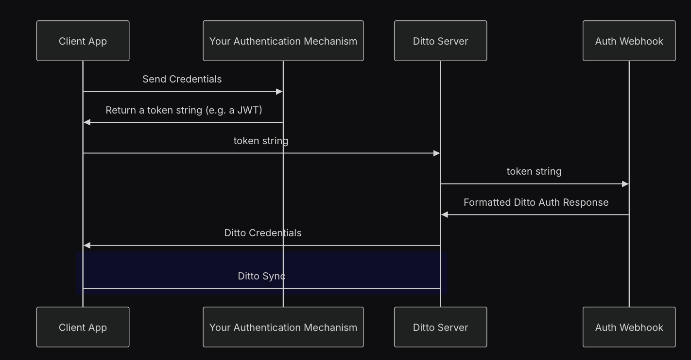

# Configurable Authentication Server

A configurable authentication server. It allows you to define user roles and permissions in a JSON configuration file, which the server uses to authenticate users and provide them with the appropriate permissions.

## Ditto Authentication

Above shows the authentication flow for the Ditto network for apps using the Online with Authentication mode. The flow is as follows:
1. The edge device sends a request to an authentication mechanis of your choice, such as Auth0.
2. On a successful login this mechanism returns a token, such as a JWT, to the edge device.
3. The edge device then sends a login request containing this token to the Ditto server.
4. The Ditto server then sends a request to a specified webhook configured in the Ditto portal.
5. The webhook then processes the token and returns the relevant permissions for the user back to the Ditto server which in turn returns Ditto credentials to the edge device.

## Quick Start

Note: This server is designed to be used with a JWT-based identity service, such as Auth0. It expects the JWT to contain a field that identifies the user, which is used to map the user to their permissions based on the roles defined in the configuration. If you are using a different token format, you may need to modify the server code to handle it appropriately.

### Setup

1. Install Node requirements:
```bash
npm install
```

2. Copy over the example config, `config.json.example` to `config.json`:
```bash
cp config.json.example config.json
```

3. Edit `config.json` for your requirements following the schema provided in `config_schema.json`.

### Running the Server

```bash
# Start with default port (3000)
node server.js

# Or start with custom port
PORT=4000 node server.js
```

#### Running locally

In order to run the webhook locally you need to expose your local machine to the internet via an https connection. For testing and demo purposes this can be done using tools like [ngrok](https://ngrok.com/docs) by running the following command after installing ngrok, replacing `<port_number>` with the port your server is running on:

```bash
ngrok http <port_number>
```

This will provide you with a public https URL that you can use as the webhook URL in the Ditto portal.

## Endpoints
- **`/`** - Health check endpoint, returns server status and timestamp
- **`/auth`** - Authentication endpoint, returns a Ditto-formatted authentication response with permissions. This is the endpoint that should be specified as the webhook in the Ditto portal.

## Configuration Reference

### Fields

- **`JWTSecret`** (string, optional): The secret used to sign the JWTs used by the server to verify the JWT, if none is provided no verification is performed.
- **`userIDField`** (string): The field in the JWT that contains the user ID in the form `path.to.userID`. You may need to configure your identity service to include a user ID in the JWT.
- **`defaultExpirationSeconds`** (int, optional): The default expiration time for the JWT in seconds, will be used if no `exp` field is present in the JWT.
- **`clientInfo`** (object | array, optional): Information to be passed through to the response. Can be a single JSON object which will be passed through as-is, or an array of paths to fields in the JWT that should be included in the response.
- **`identityServiceMetadata`** (object | array, optional): Metadata about the identity service. Can be a single JSON object which will be passed through as-is, or an array of paths to fields in the JWT that should be included in the response.
- **`roles`** (object): A mapping of roles to permissions. Each role contains an array of userIDs and an object representing the permissions for that role.
  Permissions example:
  ```json
  {
      "read": "*", # Users can read all resources
      "write": {
        "collection1": ["_id == '12345'"] # Users can write to collection1 where the _id is '12345'
      },
      "remoteQuery": false
  }
  ```
  For more information on permissions see the [Authorizing Users](https://docs.ditto.live/sdk/latest/auth-and-authorization/data-authorization) section in the docs.

More details on the configuration schema can be found in `config_schema.json` and an example configuration is provided in `config.json.example`.

# Example with the quickstart app
Here we provide an example of using the [quickstart app](https://github.com/getditto/quickstart) along with the configurable authentication webhook.

Much of the setup for this example, including configuring the webhook in the Ditto portal, setting up the Auth0 identity service and code snippets for adding Ditto authentication to your app, is covered on the [Online Authentication](https://docs.ditto.live/sdk/latest/auth-and-authorization/cloud-authentication#tutorial) page of the Ditto documentation.

## Configuring your identity service

To use the configurable authentication webhook, you will need to ensure that your identity service is configured to include a user ID in the JWT. This user ID should be accessible via a path specified in the `userIDField` of the webhook configuration.

### Configuring Auth0

Using Auth0 this could be done by including a custom claim in the JWT by adding a rule in the Auth0 dashboard.

1. Go to the Auth0 dashboard.
2. Navigate to the "Actions - Library" section.
3. Click on "Create Action - Create Custom Action".
4. Give it a name and leave the other fields as default.
5. In the rule editor, add the following code so it looks like this:

```javascript
exports.onExecutePostLogin = async (event, api) => {
  const namespace = 'http://mydittoapp.com/';
  if (event.user.name) {
    api.accessToken.setCustomClaim(`${namespace}name`, event.user.name)
  }
};
```

Save this rule.

6. Navigate to "Actions - Triggers".
7. Click on "Post Login" and add the rule you just created.
8. Click "Apply"

This will add a custom claim to the JWT containing the user account name at `http://mydittoapp.com/name`.

## Creating the webhook configuration
To create the webhook configuration, you will need to create a `config.json` file in the same directory as the server. This file should follow the schema defined in `config_schema.json`. This is an example that would work with the quickstart app and Auth0 as was setup above:

```json
{
    "JWTSecret": "your-jwt-secret" # Replace this with your actual JWT secret (found in the Auth0 dashboard), or remove this field if you don't want to verify the JWT.
    "userIDField": "http://mydittoapp.com/name", # This is the path to the user ID in the JWT, which we set in the Auth0 rule above.
    "roles": {
        "admin": {
            "members": ["user1", "user2"],
            "permissions": {
                "read": "*", # Users can read all resources
                "write": "*" # Users can write to all resources
            }
        },
        "user": {
            "members": ["user3", "user4"],
            "permissions": {
                "read": "*", # Users can read all resources
                "write": {
                    "tasks": ["_id == '12345'"] # Users can only write to documents in the tasks collection where the _id is '12345'
                }
            }
        }
    }
}
```
In this example we have defined roles for four users: `user1`, `user2`, `user3`, and `user4`. The `admin` role has permissions to read and write all resources, while the `user` role can read all resources but can only write to a specific document in the `tasks` collection.

## Hosting the webhook
To host the server it must be accessible via a public HTTPS URL. This address can then be used as a webhook URL in the Ditto portal. The address will look something like `https://<your-domain>/auth`.

## Running with the app
At this point assuming you have configured the quickstart app to use Online with Authentication mode and added login functionality, you can run the app and it will use the configurable authentication webhook to authenticate users.
